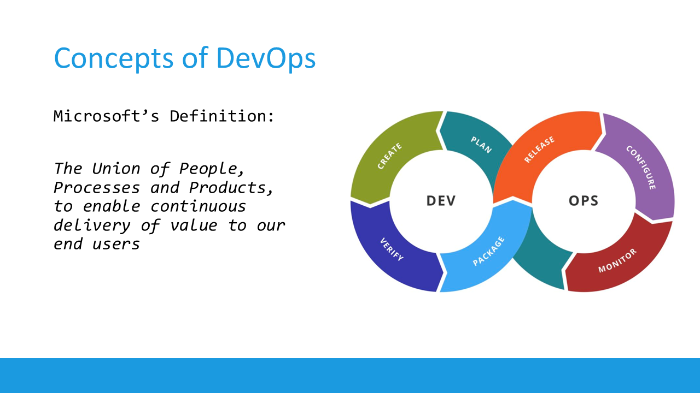

Hey folks,

Welcome to #AzureSpringClean, an initiative from **[Joe Carlyle](https://twitter.com/wedoazure) and [Thomas Thornton](https://twitter.com/tamstar1234)** which celebrates its 3rd edition this year. I'm thrilled to be part of this again for the 2nd time this year. My [first article](https://www.007ffflearning.com/post/azure-spring-clean-demystifying-service-principal-and-managed-identities/) had security in mind, explaining the difference between Azure Service Principals and Managed Identity. 

For this second article, I'm staying in the security focus, helping you **understand DevSecOps, and how you can optimize security in your application deployment lifecycle, by "shifting left"**.

I hope you learn from it, enjoy reading through and got inspired to check back the whole week here at Azure Spring Clean, as there are A TON of great topics that will be covered. 

## The Concepts of DevOps

Microsoft’s Definition: The Union of People, Processes and Products, to enable continuous delivery of value to our end users

What DevOps teams are doing is providing an automated deployment process, starting from: 

a) checking in their application source code into a source control system, such as [Azure DevOps Repos](https://azure.microsoft.com/en-us/services/devops/repos/), [GitHub Repositories](https://docs.github.com/en/repositories) or similar;
b) Once the code has been checked in, it loops through a functional testing process; 
c) This forms the starting point of Continuous Integration (CI), where the code gets compiled into an artifact or deployable package;
d) From here, the package typically gets deployed into a running state, known as Continuous Deployment (CD); this could be to a dev/test, staging or production environment;
e) Once the application workload is published, there's a handover to the Operations team, who integrate monitoring, watch over incidents and fix the problem. 

This (somewhat simplified) process gets repeated over and over (CI/CD pipeline automation), and should lead to faster deployments, less bug fixes needed and reliable workloads.

If we look at this process from a linear perspective, it would look like this:

So now you know what DevOps stands for, let’s zoom in more on the DevSecOps extension

## Shifting Left 

When you look at this application lifecycle overview, most of the security handling, but also vulnerabiltiies, are getting detected and handled **during the running phase**. That’s where we have DDOS attacks, identity or credential theft, networking attacks, crypto and similar malware etc…

While there’s nothing wrong in handling security all the way at the end, it should not be **ONLY** all the way at the end, but rather be moved **all the way to the beginning**; and becoming part of each and every stage in our DevOps process

That’s what the industry calls **“shifting left”**

So what are some of the security best practices DevOps teams can (easily) integrate into their DevSecOps process you ask? Actually there's a lot of different options and possibilities. Good news is, you can apply different security features in the different DevOps stages: 

I’ll drill down a bit more on these obviously, but let’s look at some examples:

**DEV**
- **Threat Modeling** - Microsoft provides a [free Threat Modeling Tool](https://docs.microsoft.com/en-us/azure/security/develop/threat-modeling-tool), which helps you outlining the potential threats and vulnerabilities for a generic application architecture; 

- **Credentials & Secrets Management** - NEVER store your secrets and credentials hard-coded into your source control system. That's just a NO GO!! Rather, look into [secret variables](https://docs.microsoft.com/en-us/azure/devops/pipelines/process/variables?view=azure-devops&tabs=yaml%2Cbatch), [variable groups](https://docs.microsoft.com/en-us/azure/devops/pipelines/library/variable-groups?view=azure-devops&tabs=yaml) or even better, a secret store such as [Azure Key Vault](https://docs.microsoft.com/azure/key-vault/) or [GitHub Secrets](https://docs.github.com/en/actions/learn-github-actions/environment-variables)
- Peer Review

**VALIDATE**
- **Code Analysis** - this is where you integrate source control code scanning tools such as Snyk, Sonar, WhiteSource Bolt and many others. The easiest way is going through them in your own DevOps pipelines. If you are using Azure DevOps, have a look at the [Azure DevOps Marketplace](), and search for **security**
At present, there are **91** different extensions available to integrate security into your DevOps Organization and Projects.

**PACKAGE**
- **Secured Containers** - Containers are becoming more and more popular to speed up the development process, simplifying the dependency on a platform and overall allowing for standardization thanks to Docker images. While containers are bringing in a lot of good things into a developer's scenario, they also might bring in vulnerabiities and security risks, as you don't always know where the image comes from, what's running inside the container or who built it. That's where I can definitely recommend a vulnerability scanner for containers. Tools such as Aqua or Twistlock are popular reference here. If you are using Azure as your container runtime environment, know that you can enable [Microsoft Defender for COntainers](https://docs.microsoft.com/en-us/azure/defender-for-cloud/defender-for-containers-introduction), which provides a built-in security vulnerabilty for your containers stored in Azure Container Registry. 

- Quality Gates
- Cloud Configuration
- Security & Pen-testing

**RUN**
- **Cloud Platform Security** - Any cloud vendor provides robust security features as part of the platform. Azure comes with Azure Security Center for years, which recently got rebranded to **[Microsoft Defender for Cloud]**(https://docs.microsoft.com/en-us/azure/defender-for-cloud/defender-for-cloud-introduction). Core characteristics are detecting your Secure Score, a value for your security posture, together with an extensive list of recommendations, on how to optimize your security. 
- **RBAC permissions** model - This corresponds to the concept of "least set of privileges", which means your DevOps teams should only get the administrative permissions they really need to do there job, but no more. Or even better, only give them administrative permissions when they need to perform admin tasks. Services such as [Azure Identity Protection](https://docs.microsoft.com/en-us/azure/active-directory/identity-protection/overview-identity-protection) and [Privileged Identity Management](https://docs.microsoft.com/en-us/azure/active-directory/privileged-identity-management/pim-configure) are no luxury in any organization. Keep in mind these require an Azure AD Premium P2 license. Which - if you ask me - is more than worth the extra cost! 
- Credentials & Secret Management

**OPERATE**
- Security Monitoring
- **Threat Detection** - This brings us back to the "original" approach, having the necessary security guardrails in place to protect our runtime environments. SIEM solutions such as [Azure Sentinel](https://azure.microsoft.com/en-us/services/microsoft-sentinel)
- Mitigation

## Summary
In this post, I gave you an overview of the typical DevOps process, and what challenges exist around security. Often coming in all the way at the end (during the operations cycle), security should be part of each and every step of the DevOps concept, preferably as early in the process as possible. This is what the industry calls **shifting left**. I tried to share some "easy to implement solutions" to optimize security, by sharing several tools and services available today in Azure, Azure DevOps and GitHub. If you should have any questions on this, or you want to see a demo on what the tools can do, I'm only a nudge away ;)

Once more, I very appreciated thank you for reading, and for **[Joe Carlyle](https://twitter.com/wedoazure) and [Thomas Thornton](https://twitter.com/tamstar1234)** for having accepted my submission for this 2022 #AzureSpringClean edition. Enjoy your Spring Clean week, stay safe and healthy!

Peter

