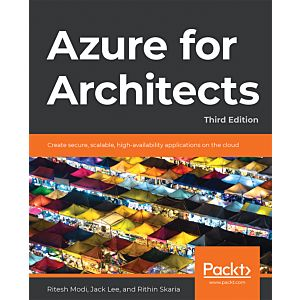

As most of you know, I enjoy writing technical (Azure related) **[books](https://www.007ffflearning.com/books)**, but every now and then I am not writing myself, but rather do technical reviewing. A few weeks ago, I was approached by **[Packt](http://www.packt.com)**, asking me to review their **[Azure for Architects - third edition](https://www.packtpub.com/cloud-networking/azure-for-architects-third-edition)**

Don't let the reference to "third edition" fool you, there has been a massive rewrite of several chapters, with fresh new content, more technical information and new chapters were added as well. 

As technical reviewer, I mainly take on the responsibility of making sure the content is technically accurate. This involves not only the textual paragraphs and descriptions, but also the reference to any hands-on step-by-step guidance as well. While this book is targeted to cloud architects, it is not just covering the high-level capability of several Azure services, but also takes the reader onto a journey about different use cases, how different services relate to each other and more. While not specifically written for it, I can tell you this work is a decent preparation for the **[Azure Solutions Architect Expert exams](https://docs.microsoft.com/en-us/learn/certifications/azure-solutions-architect)**

## About the book
Thanks to its support for high availability, scalability, security, performance, and disaster recovery, Azure has been widely adopted to create and deploy different types of application with ease. Updated for the latest developments, this third edition of Azure for Architects helps you get to grips with the core concepts of designing serverless architecture, including containers, Kubernetes deployments, and big data solutions.

You'll learn how to architect solutions such as serverless functions, you'll discover deployment patterns for containers and Kubernetes, and you'll explore large-scale big data processing using Spark and Databricks. As you advance, you'll implement DevOps using Azure DevOps, work with intelligent solutions using Azure Cognitive Services, and integrate security, high availability, and scalability into each solution. Finally, you'll delve into Azure security concepts such as OAuth, OpenConnect, and managed identities.

By the end of this book, you'll have gained the confidence to design intelligent Azure solutions based on containers and serverless functions.

## Table of Contents
1. Getting started with Azure
2. Azure solution availability, scalability, and monitoring
3. Design pattern– Networks, storage, messaging, and events
4. Automating architecture on Azure
5. Designing policies, locks, and tags for Azure deployments
6. Cost Management for Azure solutions
7. Azure OLTP solutions
8. Architecting secure applications on Azure
9. Azure Big Data solutions
10. Serverless in Azure – Working with Azure Functions
11. Azure solutions using Azure Logic Apps, Event Grid, and Functions
12. Azure Big Data eventing solutions
13. Integrating Azure DevOps
14. Architecting Azure Kubernetes solutions
15. Cross-subscription deployments using ARM templates
16. ARM template modular design and implementation
17. Designing IoT Solutions
18. Azure Synapse Analytics for architects
19. Architecting intelligent solutions

Good for almost 700 pages of deep-technical content! 

## My feedback

I have to be honest, doing technical reviewing of this book was hard for me. Being an author myself, and mainly on the exact same topics, I had to get over the fact that I was not the one writing the book. While this seems easy, it actually was harder than I initially thought. Each author has a certain writing style, starting already from the outline. (In this case, it means I might have switched the chapters in a slightly different order). 
- Knowing that each module is stand-alone, you can easily mix and match the order to your relevance. Whether you want to learn about a specific topic, maybe grab several chapters to get a clear idea about a broader solution (like containers and Kubernetes), or want to go through the book from beginning to end page after page, anyone interested in learning about Azure will find what he/she is looking for.  

Another thing I noticed, after going through most of the chapters, was the extensive background in data solutions the author(ing team) had - really, those chapters were super  detailed and I learned a lot from them myself - especially on the newer data topics from Azure Synapse (Chapter 18). This was quite nice to go through, since it's still rather new.

If you want to get a more clear view on serverless, I can definitely recommend chapters 10 and 11, both from a technical perspective as well as the promised architect overview. 

While there is nothing wrong with a 700 page book, and again, each chapter is somehow a stand-alone one, I sometimes wonder if anyone is actually capable of going through this huge amount of information. I have been "living in Azure" for almost 7 years full-time now, and at moments, it even felt heavy to me. Let alone if you are less familiar with a lot of the services. But on the other hand, this also means it could become the **"go to"** reference for Azure content. and knowing this is the third edition, I hope the Packt editor team also keeps this in mind, making sure the book is getting refreshed and updated frequently, like at least once a year (like it happened up till now already)

Last, I also like the fact a lot of code snippets are publicly available on **[GitHub](https://github.com/PacktPublishing/Azure-for-Architects-Third-Edition)**, especially useful for finding the PowerShell Scripts, Azure Resource Manager templates or Azure CLI used throughout the book. Even if after some time the Azure Portal might change, capabilities and features of the described services might (and guaranteed they will!) change, I hope the authors are also keeping this repo up-to-date. 

Feel free to reach out if you got any more questions on this book or its content. Unfortunately I don't have access to discount codes or free copies, if that would be your first ask :). However, knowing this "Azure bible" is listed for $34,99 (ebook) and $49,99 (printed+ebook), this is **really a lot of value for your money** if you ask me. 

Stay safe and healthy you all! 

/Peter